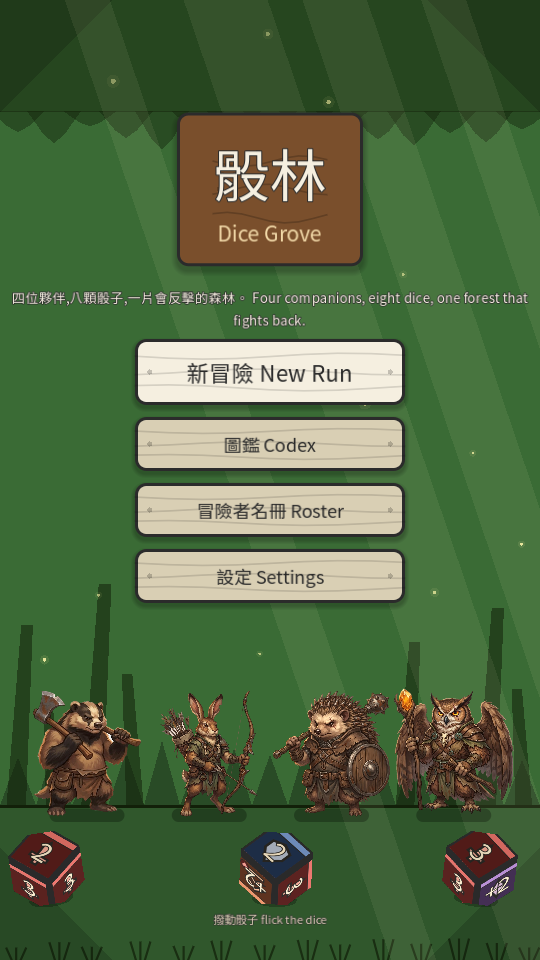
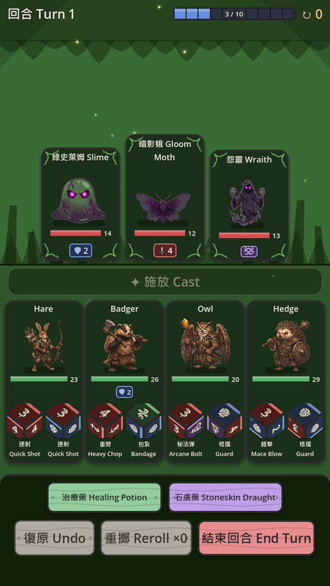
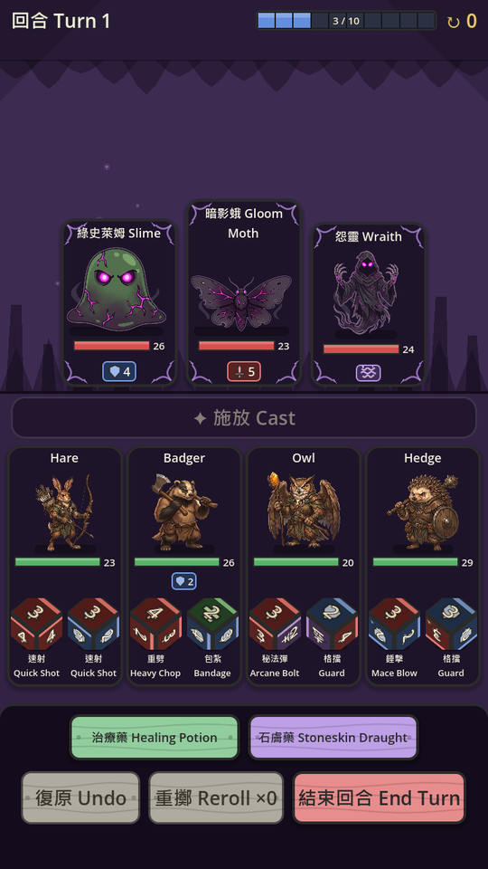
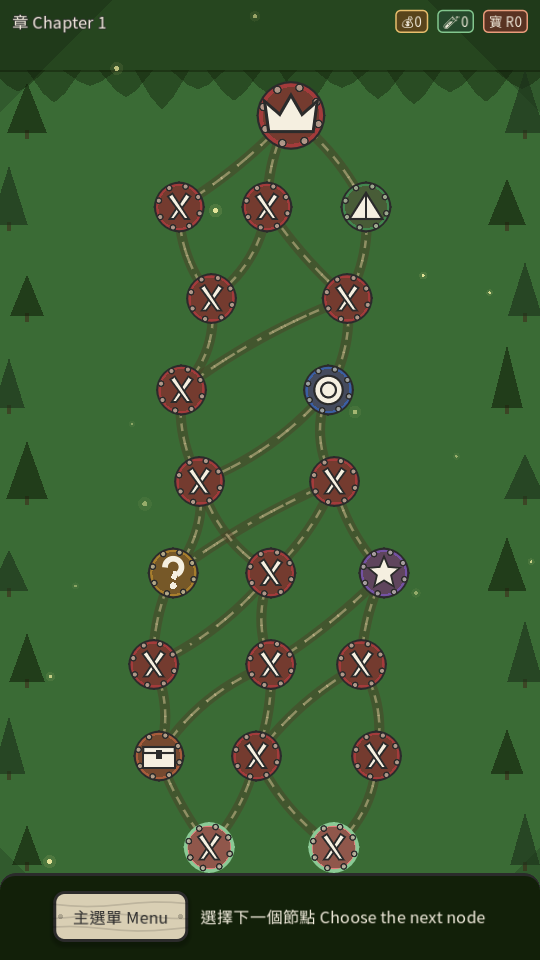
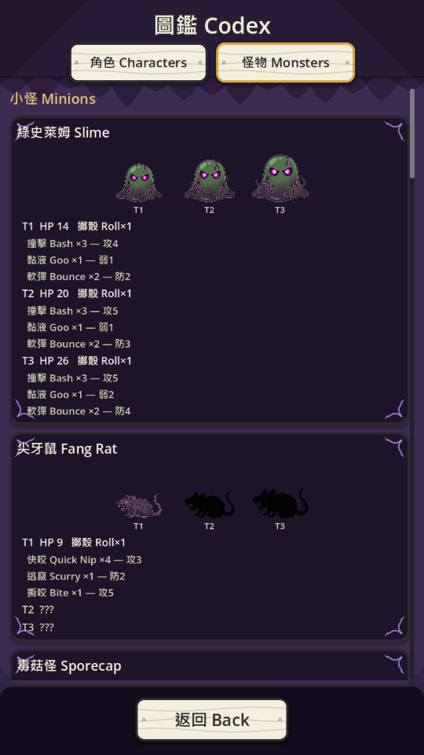
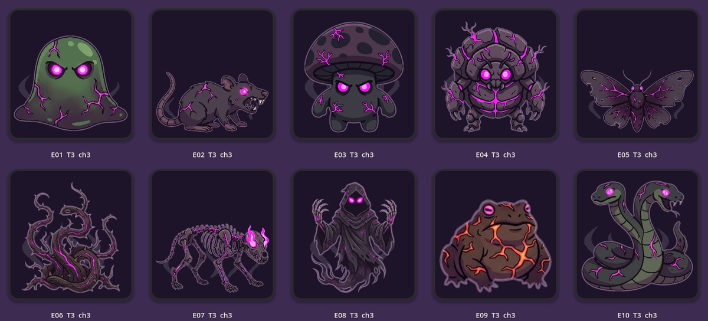
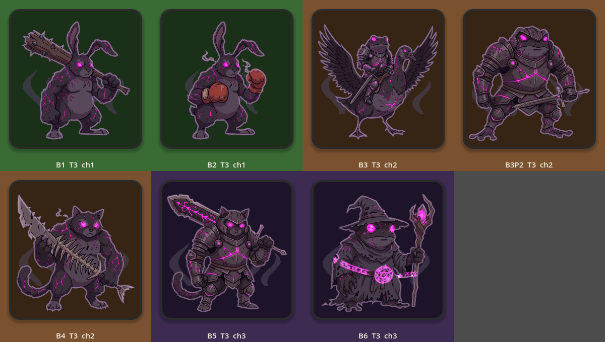

# 骰林 Dice Grove

**四位夥伴,八顆骰子,一片會反擊的森林。**
*Four companions, eight dice, one forest that fights back.*

一款直版手機向嘅**骰子構築 roguelike**(dice-builder roguelike),用 Godot 4 寫,
全程雙語(繁體中文 / English)。每場戰鬥擲骰、分配、結算;每次遠征執骰面、執遺物,
一路砌到自己嘅組合。

A portrait, mobile-first **dice-builder roguelike** written in Godot 4, bilingual
throughout (Traditional Chinese / English). Roll your party's dice each turn,
spend the faces, and build the deck of faces you roll with as the run goes on.

### ▶︎ [立即試玩 / Play in your browser](https://jackncw.github.io/game-dicebuilder/)

冇嘢要裝,手機同電腦瀏覽器都玩得。首次載入約 46 MB。
No install; runs in a desktop or mobile browser. First load is about 46 MB.

---

<p align="center">
  
  
  
</p>
<p align="center">
  
  
</p>

---

## 點玩 / How it plays

- **擲骰,唔係抽牌。** 每個英雄有自己一副骰面。回合開始全隊擲骰,你決定邊粒骰
  打邊個目標。鎖骰、重擲、復原都喺同一個階段做,唔使分開兩步。
- **骰面就係你副牌。** 戰鬥之後執新骰面、換走舊嘅,或者用骰之泉重鑄。組合係
  由骰面砌返出嚟嘅,唔係由角色等級。
- **三章,一隻怪打三次。** 同一隻小怪喺第 1、2、3 章分別係 T1/T2/T3 —— 越後
  面越腐化:體型大一級、眼著得更亮、裂紋整條發光、常駐黑霧。
- **6 隻英雄、10 隻小怪、6 個 Boss、150 個骰面、21 件遺物、12 個事件。**

Roll, don't draw: each hero owns a die, the whole party rolls at the start of a
turn, and you decide which face goes where. Locking, rerolling and undo all
happen in one player phase. Faces — not levels — are the thing you build.

<p align="center">
  
</p>
<p align="center">
  
</p>

## 本地行 / Running locally

要 [Godot 4.7+](https://godotengine.org/download)(gl_compatibility renderer,
冇 C# 冇 GDExtension)。

```bash
git clone https://github.com/jackncw/game-dicebuilder.git
cd game-dicebuilder
godot --path .                      # 直接行 / just run it
```

### 測試 / Tests

```bash
bash tools/test_all.sh              # 13 個套件,headless
```

### 出 web build / Building the web export

```bash
bash tools/web_build.sh             # -> docs/,即係 Pages 服務嗰個資料夾
```

要裝咗 Godot 嘅 Web export template。build 出嚟係**非多線程**版本 ——
Godot 嘅多線程 web export 要 `SharedArrayBuffer`,而 `SharedArrayBuffer` 要
COOP/COEP response headers,GitHub Pages 根本唔俾你設 header。

### 其他工具 / Other tools

```bash
python tools/enemy_cutout.py        # 由參考圖切 17 隻敵人 sprite
python tools/font_build.py          # 砌返隻字體(要上網)
bash tools/gallery.sh <name>        # 全遊戲截圖(要真視窗)
godot --headless --path . -- --sim 200   # 平衡模擬器
```

## 呢個 repo 入面 / Repository layout

| 路徑 | 係乜 |
|---|---|
| `scripts/core/` | 戰鬥、run state、存檔遷移、模擬器 —— 冇 UI |
| `scripts/ui/` | 全部畫面,程序化建構 Control 樹 |
| `data/*.json` | 骰面、英雄、敵人、遺物、事件、雙語文案 |
| `assets/enemies/` | `tools/enemy_cutout.py` 切出嚟嘅 sprite + 發光遮罩 |
| `tools/` | pipeline、截圖工具、測試 runner |
| `tests/` | 13 個 headless 套件 |
| `docs/` | **web build 本身**(Pages 服務呢個資料夾)+ 設計文件 |
| `DECISIONS.md` | 規格冇寫、由實作決定咗嘅嘢,連理由 |
| `BALANCE.md` | 平衡迭代記錄 |

## Web 版已知限制 / Known limits of the web build

- **首次載入約 46 MB**(39 MB wasm + 7 MB pack)。之後由瀏覽器快取。
- **存檔喺瀏覽器入面。** `user://` 喺 web 係 IndexedDB —— 換瀏覽器、無痕模式、
  清網站資料,存檔就冇咗。已驗證 refresh 之後 meta 同 run 存檔都仲喺度。
- **音效係即時合成嘅**,部分瀏覽器要你先撳一下畫面先會出聲(autoplay 政策)。
- 非多線程 build,理由見上面。

## 授權 / Licence

程式碼未定 licence。字體 `assets/fonts/DiceGroveSans-Regular.ttf` 由
Noto Sans TC / Noto Sans Symbols 2 / Noto Emoji 裁剪合併而成,行 SIL OFL 1.1,
licence 全文喺 `assets/fonts/OFL.txt`。
